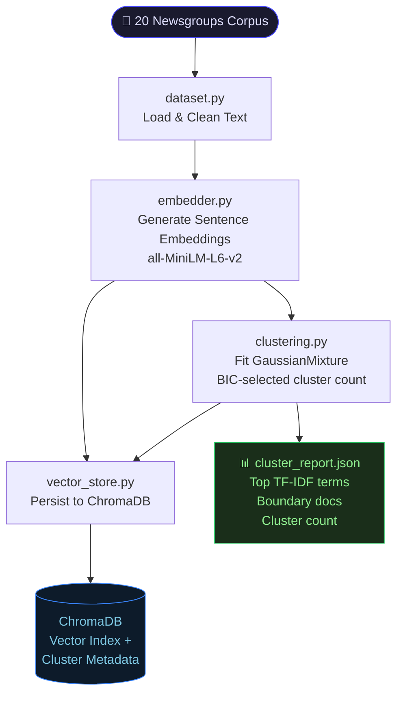
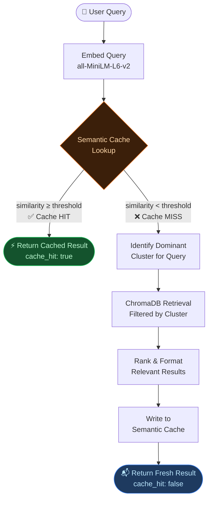
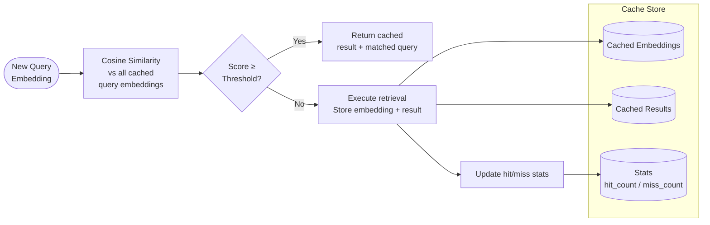
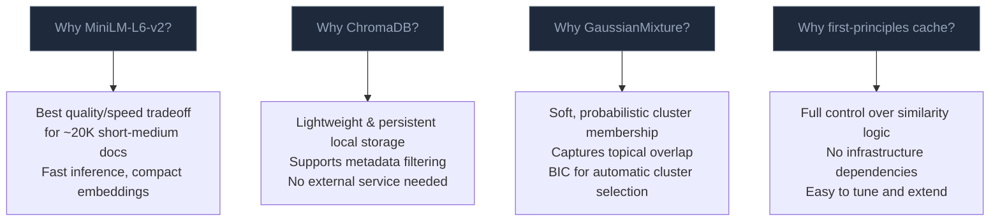

<div align="center">


# 🔍 Semantic Search API
### *Cluster-Aware Retrieval + First-Principles Semantic Cache*

> Built on the **20 Newsgroups** corpus — combining dense embeddings, fuzzy clustering, vector retrieval, and a hand-rolled semantic cache for fast, intelligent repeated responses.

</div>

---

## ✨ What This Project Does

This system answers natural language queries over a corpus of ~20,000 newsgroup posts. It is **not** a simple keyword search — it understands meaning, groups documents into fuzzy topical clusters, retrieves the most semantically relevant results, and caches prior answers so similar future queries are resolved instantly.

| Capability | Technology |
|---|---|
| Sentence Embeddings | `sentence-transformers/all-MiniLM-L6-v2` |
| Vector Storage & Retrieval | `ChromaDB` (persistent local) |
| Fuzzy Topical Clustering | `GaussianMixture` (soft, probabilistic) |
| Semantic Cache | First-principles (no Redis/Memcached) |
| API Layer | `FastAPI` + `uvicorn` |
| Containerization | `Docker` + `docker-compose` |

---

## 🗂️ Project Structure

```
Trademarkia-Task/
│
├── app/
│   ├── main.py              # FastAPI app & route definitions
│   ├── config.py            # Tunables (similarity threshold, cluster count, etc.)
│   └── core/
│       ├── dataset.py       # Load & clean 20 Newsgroups data
│       ├── embedder.py      # Sentence embedding logic
│       ├── clustering.py    # GaussianMixture fuzzy clustering
│       ├── vector_store.py  # ChromaDB read/write helpers
│       ├── semantic_cache.py# In-memory semantic cache engine
│       └── pipeline.py      # Orchestrates the full query pipeline
│
├── scripts/
│   └── build_index.py       # One-time index builder (run before API)
│
├── requirements.txt
├── Dockerfile
└── docker-compose.yml
```

---

## 🏗️ System Architecture



> **`scripts/build_index.py`** runs this entire pipeline once. If index artifacts are missing at API startup, they are auto-rebuilt.

---

## 🔄 Query Pipeline (Live API)



---

## ⚙️ Semantic Cache Deep Dive

The cache is built entirely from scratch — no Redis, no Memcached, no external libraries. Here's how it works:



### 📐 Threshold Tuning Guide

The primary tunable is `default_cache_similarity_threshold` in `app/config.py`.

| Threshold | Behavior | Risk |
|---|---|---|
| `0.78` | Very aggressive caching | High false-hit rate, semantic drift |
| `0.82` | Balanced — good starting point | Moderate |
| `0.86` | **Recommended default** | Low false-hits, decent cache utility |
| `0.90` | Conservative — high precision | Lower hit rate |
| `0.93` | Very strict — near-exact matches only | Minimal cache benefit |

**Suggested study**: run a fixed set of paraphrased queries across all thresholds and compare hit rate vs qualitative relevance.

---

## 🚀 Setup & Running

### Option 1 — Local (venv)

```bash
# 1. Create and activate virtual environment
python -m venv .venv
.venv\Scripts\activate        # Windows
source .venv/bin/activate     # macOS/Linux

# 2. Install dependencies
pip install -r requirements.txt

# 3. Build the index (first time only)
python -m scripts.build_index

# 4. Start the API
uvicorn app.main:app --host 0.0.0.0 --port 8000
```

> ⚠️ If artifacts are missing at startup, the API will auto-trigger `build_index` once.

### Option 2 — Docker

```bash
# Build and run with Docker
docker build -t tm-semantic-cache .
docker run -p 8000:8000 tm-semantic-cache

# Or with docker-compose
docker-compose up --build
```

---

## 📡 API Endpoints

### `POST /query`

Submit a natural language query and get semantically relevant results.

**Request:**
```json
{ "query": "How does gun policy relate to politics?" }
```

**Response:**
```json
{
  "query": "How does gun policy relate to politics?",
  "cache_hit": true,
  "matched_query": "What is the relationship between firearms and political debate?",
  "similarity_score": 0.91,
  "result": "...",
  "dominant_cluster": 3
}
```

---

### `GET /cache/stats`

Returns current cache performance metrics.

```json
{
  "total_entries": 42,
  "hit_count": 17,
  "miss_count": 25,
  "hit_rate": 0.405
}
```

---

### `DELETE /cache`

Flushes the in-memory cache and resets all stats.

---

## 📊 Cluster Artifacts

After `build_index` runs, a report is saved to:

```
data/artifacts/cluster_report.json
```

This file contains:
- **Selected cluster count** — chosen via BIC across candidate values
- **Top TF-IDF terms** per cluster — for semantic labeling and interpretation
- **Boundary documents** — high-uncertainty docs that span multiple clusters

These artifacts help explain semantic overlap, topical meaning, and uncertainty regions across the corpus.

---

## 🧠 Design Decisions



---

## ✅ Submission Checklist

- [x] Push project to GitHub repository
- [ ] Deploy API (Render / Railway / Fly.io / Azure)
- [ ] Collect live deployment URL
- [ ] Grant repo access to `recruitments@trademarkia.com`
- [ ] Submit both links at [https://forms.gle/4RpHZpAi8rbG9QCE8](https://forms.gle/4RpHZpAi8rbG9QCE8)

---

<div align="center">

Built with 🔍 semantic intelligence · ⚡ smart caching · 🧩 fuzzy clustering

</div>
